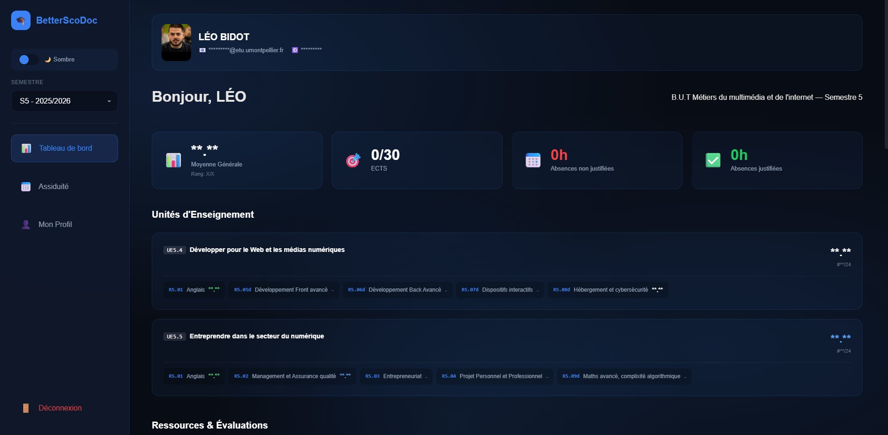
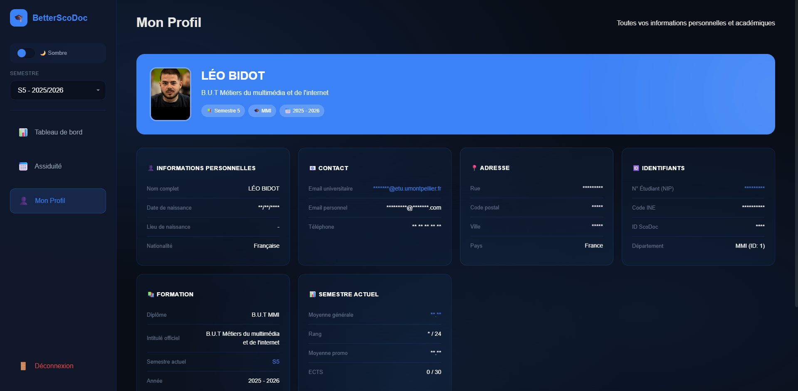

# BetterScoDoc 🎓

<div align="center">
  <h3>Page d'accueil</h3>
  
  <br/><br/>
  <h3>Page de profil</h3>
  
</div>
 <br/>

**BetterScoDoc** est une extension de navigateur qui transforme et modernise complètement l'interface de ScoDoc (logiciel de gestion de scolarité). Elle offre un design épuré, moderne et réactif pour une meilleure expérience utilisateur.

## ✨ Fonctionnalités

*   **Interface Moderne et Fluide** : Un design repensé avec une esthétique "Glassmorphism", des cartes épurées et des animations soignées.
*   **Thèmes Sombre & Clair** : Support natif du mode sombre (activé par défaut) et d'un mode clair élégant, avec bascule facile.
*   **Tableau de Bord Enrichi** :
    *   **Statistiques Complètes** : Moyenne générale, rang dans la promo, ECTS acquis et absences.
    *   **Décision Année/Semestre** : Affichage clair de la décision du jury (Admis, Ajourné, etc.).
    *   **Graphique Comparatif** : Comparez vos moyennes par UE avec celles de la promotion en un clin d'œil.
*   **Détail des Formations** :
    *   **Visualisation des UEs** : Statut de validation (Admis/Ajourné) et moyennes visibles directement.
    *   **SAÉ & Portfolio** : Section dédiée pour suivre vos Situations d'Apprentissage et d'Évaluation.
    *   **Notes Détaillées** : Cliquez sur n'importe quelle ressource pour voir le détail des évaluations, les coefficients et les statistiques de la promo.
*   **Export PDF** : Générez un bulletin propre et formaté pour l'impression ou l'archivage en un clic.
*   **Notifications de Notes** : Soyez alerté des nouvelles notes directement lors de l'ouverture (badge "Nouveau").
*   **Navigation Intuitive** : Barre latérale avec sélecteur de semestre amélioré pour naviguer dans votre historique.


## 🚀 Installation

### 🌐 Chrome / Brave / Edge (Recommandé)

1.  Allez dans les [Releases](https://github.com/LeoBdt/BetterScoDoc/releases) et téléchargez le fichier `BetterScoDoc.zip` (pas le code source).
2.  Décompressez l'archive.
3.  Ouvrez votre navigateur et allez sur `chrome://extensions`.
4.  Activez le **Mode développeur** (en haut à droite).
5.  Cliquez sur **Charger l'extension non empaquetée** (Load unpacked).
6.  Sélectionnez le dossier décompressé `BetterScoDoc`.
7.  Rendez-vous sur ScoDoc !

### 🍎 Safari (macOS)

1.  Téléchargez `BetterScoDoc-macOS.zip` dans les Releases.
2.  Décompressez l'archive pour obtenir `BetterScoDoc.app`.
3.  Déplacez l'application dans votre dossier **Applications**.
4.  Lancez l'application.
5.  Dévelopemment > Réglages Développeurs > Activer les extensions non signées
6.  Cliquez sur le bouton pour ouvrir les préférences Safari et activez l'extension.

**⚠️ "L'application est endommagée" ?**
Comme l'application n'est pas signée par Apple (ce qui est payant), vous aurez probablement ce message d'erreur. Pas de panique, voici comment l'ouvrir :
1.  Ouvrez l'application **Terminal** sur votre Mac.
2.  Copiez-collez cette commande et validez :
    ```bash
    xattr -cr /Applications/BetterScoDoc.app
    ```
3.  Relancez l'application, ça marche !

## 🛠️ Développement

Pour contribuer ou modifier l'extension :

1.  **Cloner le dépôt** :
    ```bash
    git clone https://github.com/votre-pseudo/BetterScoDoc.git
    cd BetterScoDoc
    ```

2.  **Installer les dépendances** :
    ```bash
    npm install
    ```

3.  **Lancer le serveur de développement** (pour tester l'UI hors extension) :
    ```bash
    npm run dev
    ```

4.  **Construire l'extension** (build production) :
    ```bash
    npm run build
    ```
    Le dossier `dist/` contiendra l'extension compilée prête à être chargée sur Chrome.

5.  **Empaqueter le ZIP Chrome** :
    ```bash
    ./package.sh
    ```
    
6.  **Convertir pour Safari** (Nécessite Xcode) :
    ```bash
    xcrun safari-web-extension-converter dist --project-location ../BetterScoDoc_Safari --app-name BetterScoDoc --bundle-identifier com.leobidot.betterscodoc
    ```

## 💻 Technologies

*   [React](https://reactjs.org/) - Bibliothèque UI
*   [Vite](https://vitejs.dev/) - Build tool rapide
*   CSS3 (Variables, Flexbox, Grid) - Styles personnalisés sans framework lourd

## 📄 Licence

Ce projet est sous licence MIT. Libre à vous de l'utiliser et de le modifier.
